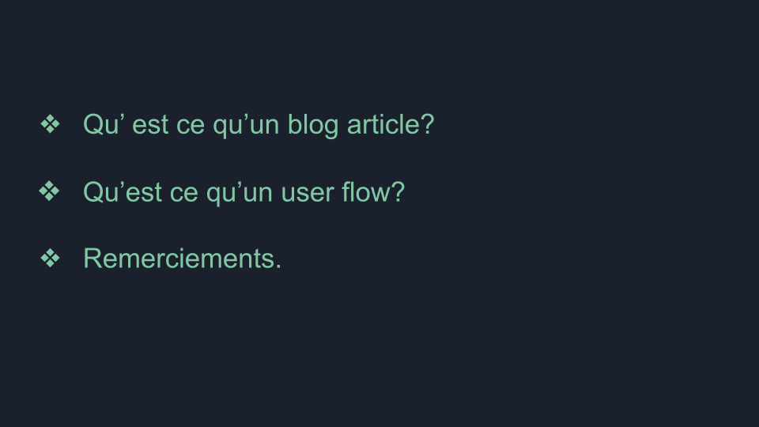
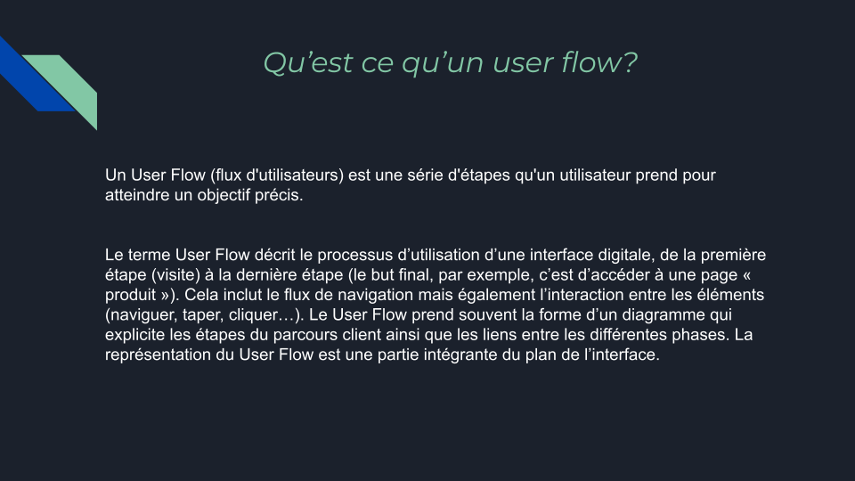
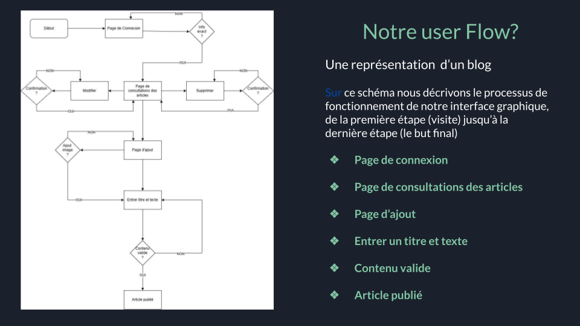
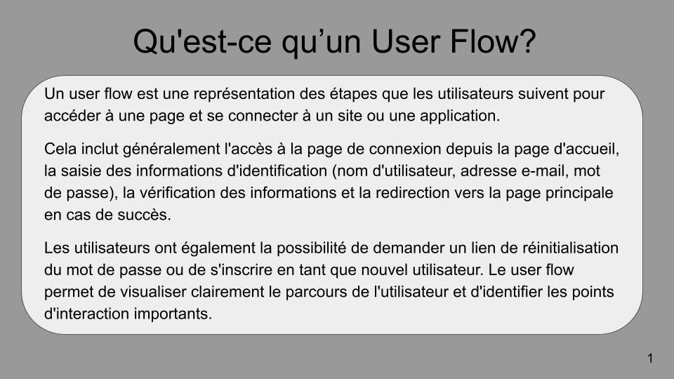

# Préparation au brief 6

## Site Web et application DSI sensibilisation au handicap dédié au professionnels.

Après avoir modifier la maquette de landing page sur les recommandations du client (DSI) et de l'ux/ui designer (Pierre), vous devez mettre en place les étapes de collaboration à la gestion du projet et à l’organisation de l’environnement de développement pour le futur site et la future application qui permettra à DSI d'animer ses ateliers de sensibilisation au handicap. 

Retour par groupe du formateur après vos rendus sur Simplonline.
En tant que concepteur développeur d'application, en prenant en compte les besoins du projet et les compétences de chaque individu de votre groupe vous devrez :
- Désigner un chef de projet pour votre groupe,
- Lister les fonctionnalités de la future application,
- Penser à la conception de la future base de données,
- Mettre en place un workflow,
- Concevoir une application.

->UML et MLD de la base de données
->Use Case
->Github (branches et gestion des conflits)
->User flow
->Wireframe
->mind map
->Trello ou Jira (attribution des tâches et décomposition des fonctionnalités en US = User story)
->Compte rendu de vos échanges oraux ou écrits avec le client
->Délimitation du MVP (minimum viable du produit) et anticipation des futurs évolutions du projet

### UML et MLD de la base de données

**UML**:

**Diagramme de classe**:
[UML 2 - de l'apprentissage à la pratique](https://laurent-audibert.developpez.com/Cours-UML/?page=diagramme-classes)

Pensez à l’**héritage** quand vous pouvez en faire:
[Héritages (MCD/MLD)](https://help.sap.com/docs/SAP_POWERDESIGNER/856348b84a7c479489d5172a630f014d/c7c34d286e1b1014afdcc9aecdb28247.html?version=16.7.01)

**MLD**:
Base de données SQL (voir Google doc)

### Use case

Imaginez que vous essayez d’expliquer le fonctionnement d’une application à quelqu’un, c’est assez difficile de faire comprendre l'interaction entre l’application et l’utilisateur. 
C’est à cela que servent les Diagrammes de Use Cases.
Ils permettent d’expliquer facilement les interactions et les relations entre différentes entités. 

#### Les composants des diagrammes use case

SYSTEMS (site web, composant logiciel, une application etc…) 
ACTORS (quelque chose ou quelqu’un qui utilise le système)
USE CASES (action à définir)
RELATIONSHIPS (interactions)

    

##### Systems

    

##### Actors

PRIMARY ACTORS / Acteur principale, il initie l’utilisation du système 
SECONDARY ACTORS / Acteur secondeur réagit

##### Exemple d’un cas simple pour application bancaire

On veut qu’il y est la possibilité de :
- se connecter
- vérifier l’argent qu’on à sur le compte
- faire un transfert avec un autre compte
- faire des paiements

Qui sont les acteurs?

    

#### USE CASES / Cas d’utilisations

Les uses cases décrivent ce que fait le système.

Ils sont définis par un oval et représentent une action qui accomplit une tâche du système. 

    

##### Exemple d’un cas simple pour application bancaire

On veut qu’il y est la possibilité de :
- se connecter
- vérifier l’argent qu’on à sur le compte
- faire un transfert avec un autre compte
- faire des paiements
**On doit donc avoir un use case pour chacune de ces actions.**

    

#### Relationship / relation ou interaction

Chaque acteur doit interagir avec au moins un use case du système. 
interaction: 
association (basique communication ou interaction) 

Avec qui va intéragir la banque?

    

    

    

    

##### Exemple d’un cas simple pour application

On veut qu’il y est la possibilité de :
- se connecter → le mot de passe devra être vérifiée et afficher une erreur s’il n’est pas bon
- vérifier l’argent qu’on à sur le compte
- faire un transfert avec un autre compte → vérifier s’il y a assez d’argent sur le compte
- faire des paiements → depuis le compte de débit ou depuis les économies 
**On doit donc avoir un use case pour chacune de ces actions.**

    

    

Quelle genre de relation entre:

- se connecter
- vérifier mot de passe  
- afficher erreur
- afficher solde 
- transférer 
- payer
- vérifier fond
- compte principale
- compte épargne

    

    

    

    

### Github (branches et gestion des conflits)

    

    

#### Architecture DEV

- main
- Dev
 - coder 1
 - coder 2

### User flow

[Comprendre le user flow](https://lagrandeourse.design/blog/quest-ce-que-le-user-flow/#:~:text=Un%20User%20Flow%20est%20une,%C3%A0%20utiliser%2C%20clair%20et%20intuitif.)

    

    

Veille, user flow blog article:

    

    

    

    

Veille, user flow:

    

    

    

    

    

    

### WireFrame

Les wireframes représentent une interface sobre. Les designers intègrent généralement les éléments graphiques et contenus suivants :
- En tête et pied de page
- Barre de navigation
- Boutons call-to-action
- Fil d’Ariane
- Éléments de formulaire
- Zones pour les images ou médias

[wireframe](https://www.usabilis.com/definition-wireframe/#:~:text=Le%20Wireframe%20est%20la%20maquette,un%20degr%C3%A9%20d%27interactivit%C3%A9%20variable.)

### Mindmap

### Lean prototyping

[lean prototyping OpenClassroom](https://openclassrooms.com/fr/courses/4781491-testez-vos-idees-avec-le-lean-prototyping/5480506-determinez-le-perimetre-fonctionnel-de-votre-prototype)

#### Déterminer le périmètre fonctionnel du prototype

Avant de construire votre MVP, il est important d'en définir son périmètre fonctionnel et de le structurer.
Le périmètre fonctionnel de votre MVP représente  l'ensemble (restreint) des actions que vous allez rendre disponibles à vos utilisateurs.

Le risque lorsque vous définissez le périmètre fonctionnel de votre prototype est double :
- le périmètre est trop réduit, auquel cas vous n'arriverez pas à reproduire l'expérience utilisateur que vous souhaitez offrir à vos clients ;
- le périmètre est trop large (souvent le cas le plus fréquent), ce qui impliquerait des investissements en termes de temps (notamment le vôtre), énergie et argent beaucoup trop importants.

##### Comment définir le périmètre fonctionnel ?

Il existe plusieurs options pour préparer dans les meilleures conditions la première étape du cycle d'apprentissage **lean** (construire). 
Vous avez maintenant une idée assez précise de ce que vous souhaitez construire, il est alors temps de la structurer.

###### Le backlog produit
Dans les méthodes agiles et notamment SCRUM, le document censé rassembler toutes les fonctionnalités d'un produit s'appelle le backlog produit.
=> liste priorisée des fonctionnalités d’un produit
>L'idée du backlog produit est de centraliser toutes les informations relatives au développement des nouvelles fonctionnalités d'un produit.

En somme, le backlog produit et une liste de fonctionnalités triées par ordre de priorité et documentées (si nécessaire).
L'importance des informations présentes dans le backlog s'adapte à la phase de maturité du produit. Lorsque vous commencez à construire un MVP, vous aurez tendance à vous concentrer sur sa sortie rapide sur le marché plutôt que sur la maintenance d'un backlog produit parfait.
Le backlog produit est en effet un outil évolutif qui grandira avec votre produit et votre équipe. C'est une des raisons pour lesquelles un outil comme Trello est un compagnon de choix pour créer son backlog.

**Un outil pour organiser votre backlog, Trello**:
Trello est un outil pratique pour centraliser, structurer et rassembler les informations concernant le fonctionnement d'un produit (peu importe son stade d'avancement). C'est un outil en ligne complètement gratuit, super accessible et très flexible.

Backlog produit, mais qu'en est-il de la description des fonctionnalités?

###### Anatomie d’une **user story**:
>Une user story est« une courte phrase décrivant en détail l’action que l’on souhaite rendre disponible à nos utilisateurs ».
Sur Trello, elle est représentée par une carte.

**Une user story (aussi appelée US) se compose de 3 parties distinctes, un type d'utilisateur, une action à réaliser et une finalité.**
Exemple:
En tant que [type d'utilisateur], j'aimerais pouvoir [action à réaliser] dans le but de [finalité].

-> **Le type d'utilisateur**:
L'on peut très bien appeler toutes les personnes visitant le site des « utilisateurs ». Plus l'on détaille l'user story, mieux l'on se met en situation.

>Une personne qui visite pour la première fois votre site pourrait alors s’appeler un « visiteur » plutôt qu’un « utilisateur ». Un utilisateur quant à lui pourrait rentrer dans la catégorie des personnes ayant créé un compte ou même déjà « utilisé » votre service (réserver une sieste par exemple).

>Encore une fois, au stade de MVP, il n’est pas nécessaire de passer trop de temps sur les détails de votre backlog.

Exemple:
Partons donc sur un visiteur et rédigeons la première partie de notre user story :

-> L'action à réaliser

Description précise de l'action que l'utilisateur doit être capable de réaliser sur l'application. **Le contexte est clé!**
Si l'on rédige la story concernant la création d’un compte alors il faut se mettre  à la place du visiteur du site (qui n’est pas encore un utilisateur 🤓) :
"En tant que visiteur de..., j'aimerais pouvoir [créer un compte]"
L'on peut dans cette carte commencer à documenter la fonctionnalité en indiquant les informations nécessaires à la création d'un compte (cheklist par exemple).
L'on peut également ajouter des wireframes (si besoin) concernant la fonctionnalité nécessaire à son bon développement.

-> Finalité 
Bien qu'optionnelle, cette partie de la story permet de s'immerger encore plus dans l’exercice. 
Elle consiste à décrire la finalité de l’action réalisée.
Exemple:
« En tant que visiteur de ..., j’aimerais pouvoir créer un compte afin d’être en mesure [d'utiliser le service proposé] »

=> Cet exercice permet dans un premier temps de se mettre à la place de l'utilisateur, mais aussi de communiquer simplement l'objectif et le comportement attendu d’une fonctionnalité à des équipes de développement (et autres).

### Entretien avec Hafida

article type blog??
se mettre à la place d'un client

ce qui ne doit pas changer:
texte?

garde version code couleur dsi, et une version avec notre propre charte

moderniser
animation

[exemple](https://neuroinclusive.design/en/)
[exemple](https://www.print-dsi.com/)
[exemple](https://www.youtube.com/watch?v=89CKBJoZ8P4&ab_channel=GillesDevendeville)
[exemple](https://www.leadgenerator.fr/blog/le-call-to-action-cta-en-btob)

récupèrer photos
se lâcher 
call to action
pop up

-----------------------------------------------------

merise, diagramme de classe -> bdd
heritage en mcd

wireframe

mentions légales
