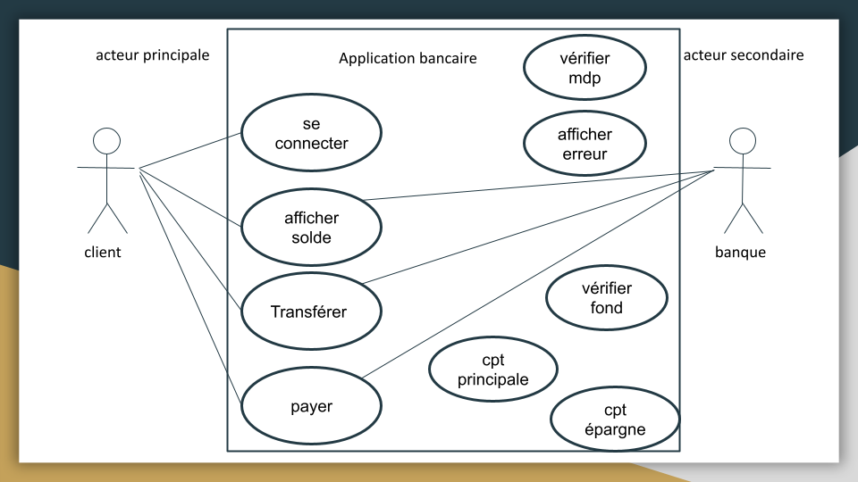

# Préparation au brief 6

## Site Web et application DSI sensibilisation au handicap dédié au professionnels.

Après avoir modifier la maquette de landing page sur les recommandations du client (DSI) et de l'ux/ui designer (Pierre), vous devez mettre en place les étapes de collaboration à la gestion du projet et à l’organisation de l’environnement de développement pour le futur site et la future application qui permettra à DSI d'animer ses ateliers de sensibilisation au handicap. 

Retour par groupe du formateur après vos rendus sur Simplonline.
En tant que concepteur développeur d'application, en prenant en compte les besoins du projet et les compétences de chaque individu de votre groupe vous devrez :
- Désigner un chef de projet pour votre groupe,
- Lister les fonctionnalités de la future application,
- Penser à la conception de la future base de données,
- Mettre en place un workflow,
- Concevoir une application.

->UML et MLD de la base de données
->Use Case
->Github (branches et gestion des conflits)
->User flow
->Wireframe
->mind map
->Trello ou Jira (attribution des tâches et décomposition des fonctionnalités en US = User story)
->Compte rendu de vos échanges oraux ou écrits avec le client
->Délimitation du MVP (minimum viable du produit) et anticipation des futurs évolutions du projet

### UML et MLD de la base de données

**UML**:

**Diagramme de classe**:
[UML 2 - de l'apprentissage à la pratique](https://laurent-audibert.developpez.com/Cours-UML/?page=diagramme-classes)

Pensez à l’**héritage** quand vous pouvez en faire:
[Héritages (MCD/MLD)](https://help.sap.com/docs/SAP_POWERDESIGNER/856348b84a7c479489d5172a630f014d/c7c34d286e1b1014afdcc9aecdb28247.html?version=16.7.01)

**MLD**:
Base de données SQL (voir Google doc)

### Use case

Imaginez que vous essayez d’expliquer le fonctionnement d’une application à quelqu’un, c’est assez difficile de faire comprendre l'interaction entre l’application et l’utilisateur. 
C’est à cela que servent les Diagrammes de Use Cases.
Ils permettent d’expliquer facilement les interactions et les relations entre différentes entités. 

#### Les composants des diagrammes use case

SYSTEMS (site web, composant logiciel, une application etc…) 
ACTORS (quelque chose ou quelqu’un qui utilise le système)
USE CASES (action à définir)
RELATIONSHIPS (interactions)

    

##### Systems

    

##### Actors

PRIMARY ACTORS / Acteur principale, il initie l’utilisation du système 
SECONDARY ACTORS / Acteur secondeur réagit

##### Exemple d’un cas simple pour application bancaire

On veut qu’il y est la possibilité de :
- se connecter
- vérifier l’argent qu’on à sur le compte
- faire un transfert avec un autre compte
- faire des paiements

Qui sont les acteurs?

    

#### USE CASES / Cas d’utilisations

Les uses cases décrivent ce que fait le système.

Ils sont définis par un oval et représentent une action qui accomplit une tâche du système. 

    

##### Exemple d’un cas simple pour application bancaire

On veut qu’il y est la possibilité de :
- se connecter
- vérifier l’argent qu’on à sur le compte
- faire un transfert avec un autre compte
- faire des paiements
**On doit donc avoir un use case pour chacune de ces actions.**

    

#### Relationship / relation ou interaction

Chaque acteur doit interagir avec au moins un use case du système. 
interaction: 
association (basique communication ou interaction) 

Avec qui va intéragir la banque?

    

    

    

    

##### Exemple d’un cas simple pour application

On veut qu’il y est la possibilité de :
- se connecter → le mot de passe devra être vérifiée et afficher une erreur s’il n’est pas bon
- vérifier l’argent qu’on à sur le compte
- faire un transfert avec un autre compte → vérifier s’il y a assez d’argent sur le compte
- faire des paiements → depuis le compte de débit ou depuis les économies 
**On doit donc avoir un use case pour chacune de ces actions.**

    

    

Quelle genre de relation entre:

- se connecter
- vérifier mot de passe  
- afficher erreur
- afficher solde 
- transférer 
- payer
- vérifier fond
- compte principale
- compte épargne

    

    

    

    

### Github (branches et gestion des conflits)

    

    

#### Architecture DEV

- main
- Dev
 - coder 1
 - coder 2

### User flow

[comprendre le user flow](https://lagrandeourse.design/blog/quest-ce-que-le-user-flow/#:~:text=Un%20User%20Flow%20est%20une,%C3%A0%20utiliser%2C%20clair%20et%20intuitif.)

    

    

### WireFrame

Les wireframes représentent une interface sobre. Les designers intègrent généralement les éléments graphiques et contenus suivants :
- En tête et pied de page
- Barre de navigation
- Boutons call-to-action
- Fil d’Ariane
- Éléments de formulaire
- Zones pour les images ou médias

[wireframe](https://www.usabilis.com/definition-wireframe/#:~:text=Le%20Wireframe%20est%20la%20maquette,un%20degr%C3%A9%20d%27interactivit%C3%A9%20variable.)

### Mindmap

### Entretien avec Hafida

article type blog??
se mettre à la place d'un client

ce qui ne doit pas changer:
texte?

garde version code couleur dsi, et une version avec notre propre charte

moderniser
animation

[ex](https://neuroinclusive.design/en/)
[ex](https://www.print-dsi.com/)
[ex](https://www.youtube.com/watch?v=89CKBJoZ8P4&ab_channel=GillesDevendeville)
[ex](https://www.leadgenerator.fr/blog/le-call-to-action-cta-en-btob)

récupèrer photos
se lâcher 
call to action
pop up

### Notes 

merise, diagramme de classe -> bdd
heritage en mcd

use case
extends:
use case utilisation connecter include obligatoire
mauvais mdp msg erreur extends pas obligatoire
generalisation -> cas particulier, plusieurs cas possibles